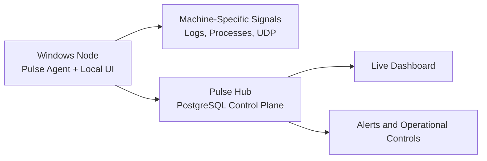

# Pulse

Operational monitoring for modern playout environments.

Pulse gives operators a cleaner way to monitor broadcast and playout machines across multiple locations without turning every deployment into a custom engineering project. It combines a lightweight node agent on each Windows PC, a central hub for oversight and alerting, and a live dashboard that helps teams spot issues quickly, understand what changed, and respond with confidence.

The product is built for environments where every machine may be slightly different, but the operational standard still needs to be consistent. That is where Pulse is strongest: flexible at the node, centralized at the hub, and practical in day-to-day use.

## Why Pulse

- One monitoring view across multiple sites and playout machines
- Local node setup that adapts to the realities of each PC
- Centralized monitoring state, alerting, and operational control
- Faster rollout with a generic installer instead of endless per-node rebuilds
- Lower setup friction by delaying admin permission until the final service install step
- Support for the real signals operators care about: logs, process state, runtime health, and UDP stream inputs
- Playout-profile driven onboarding that can handle native and generic vendor shapes from the same installer

## What Makes It Different

Most monitoring tools force a choice between rigid central configuration and fragile one-off machine setups.

Pulse takes a more practical approach:

- The node owns machine-specific details such as log paths, selectors, playout type, and stream inputs
- The hub owns the shared operational layer such as alert routing, maintenance mode, monitoring status, tokens, and inventory

That split makes the platform easier to deploy, easier to scale, and easier to support over time. New machines can be brought online without redesigning the whole system, while operators still get one grounded view of what is happening across the estate.

## Built For Real Operations

Pulse is designed for teams that need monitoring to be useful under real pressure, not just technically correct on paper.

- It stays close to the machine by reading the local signals that actually describe player behavior
- It keeps the operator experience simple by presenting that state centrally
- It supports a generic installer flow for flexible deployment on new machines
- It still allows prepared bundles where a pre-configured rollout is useful

This makes Pulse a good fit for environments where rollout speed, supportability, and clarity matter just as much as raw monitoring depth.

## Architecture At A Glance

The architecture is intentionally simple to reason about:

- the agent stays close to the machine
- the hub centralizes control and persistence
- the dashboard gives operators one place to watch the estate

## Current Product Direction

- PostgreSQL-backed hub persistence
- Generic Windows installer as the default deployment path
- Expanded playout profile model for native and generic vendor onboarding
- Local UI as the source of truth for machine-specific configuration
- Hub as the source of truth for central operational state

## Learn More

The README is intentionally high-level. Detailed implementation and operational documents live in the `docs` folder.

- Product summary: [docs/PRD.md](docs/PRD.md)
- Architecture: [docs/ARCHITECTURE.md](docs/ARCHITECTURE.md)
- Deployment guide: [docs/DEPLOYMENT.md](docs/DEPLOYMENT.md)
- VPS operations checklist: [docs/VPS_OPERATIONS_CHECKLIST.md](docs/VPS_OPERATIONS_CHECKLIST.md)
- User manual: [docs/USER_MANUAL.md](docs/USER_MANUAL.md)
- Agent install guide: [docs/AGENT_INSTALL.md](docs/AGENT_INSTALL.md)
- Monitoring rules: [docs/MONITORING_SPEC.md](docs/MONITORING_SPEC.md)
- Technical decisions: [docs/DECISIONS.md](docs/DECISIONS.md)
- Tech stack: [docs/TECH_STACK.md](docs/TECH_STACK.md)
- Release record: [docs/RELEASE_KB_2026-03-27.md](docs/RELEASE_KB_2026-03-27.md)
